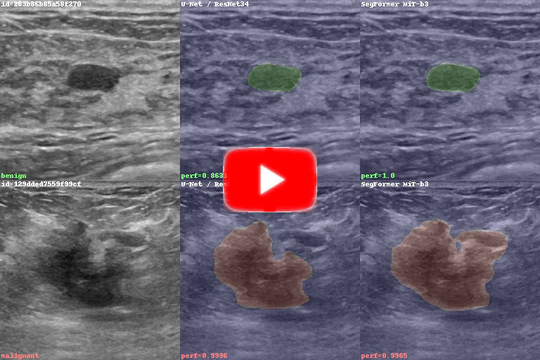

I have completed the Master of Science in Data Science (MSDS) program at the University of Wisconsin. This is my capstone project - code, paper, and artifacts.

Read the full paper here (CTRL-click or right-click to open in new tab):

[Semantic Segmentation for Medical Ultrasound Imaging](Capstone%20Paper%20-%20Semantic%20Segmentation%20for%20Medical%20Ultrasound%20Imaging.pdf)

Video of my models looking for benign / malignant lesions on breast ultrasound images (CTRL-click or right-click to open in new tab):

# Overview

This work was done within the BUS Project at the University of Wisconsin, led by Dr. Jeffrey Baggett. Together with the Mayo Clinic, represented by Dr. Richard Ellis, they are working on a feasibility study aiming to develop state-of-the-art breast ultrasound lesion interpretation support software for radiologists. In plain words, they research deep learning techniques to improve breast cancer diagnostic and patient outcomes. Link to parent project:

https://datascienceuwl.github.io/CADBUSI/

Within the BUS Project, this work (my capstone project) has aimed to create deep learning models that can identify lesions (benign or malignant) in breast ultrasound images, and highlight their area and contour on the images. Some models classify the lesions based on their nature (benign or malignant) and indicate the lesion class via color codes.

This, in a nutshell, is image segmentation applied to ultrasound imaging.

Model performance was on part with state-of-the-art segmentation models for ultrasound imaging.

# Tech Details

## Datasets

Vision models need to be trained on large datasets. Ultrasound imaging datasets are small and hard to find. The project had access to four small fully labeled datasets, and one large dataset that had class labels (benign, malignant) but no mask labels.

I wrote dataloader functions which take images from all four fully labeled datasets, and present them to the models as a single, larger, uniform dataset of nearly 1800 images total.

Typical image augmentations were applied to the datasets, with some adjustments for this specific domain - see the paper for details.

The video you see above contains predictions on the large, partially labeled dataset, which had nearly 200 video sequences with a total of about 25k image frames.

## Models

As a safe, known-good approach, I've trained an older architecture, U-Net with a ResNet34 backbone, which was known to work well on ultrasound datasets.

To try and get the best performance possible, I've also fine-tuned a transformer model, the SegFormer.

Both models were pre-trained on ImageNet.

## Hyperparameter Optimization

This was the most time-consuming part of the project. Training a single model on an RTX 3090 GPU takes about 1 hour. I had a hyperparameter optimization loop, with Optuna, running a search in hyperparameter space for the best performance.

The performance metric that was optimized is intersection-over-union (IoU).

For more details see the paper, but basically the learning rate had by far the biggest impact on model performance. The number of freeze epochs mattered somewhat for U-Net. The warmup ratio had a mild impact on the SegFormer. The other parameters I've explored were much less important.

## Code

These are the main notebooks with the optimization code for the main models:

- [unet_fine_tune.ipynb](unet_fine_tune.ipynb)
- [segformer_fine_tune.ipynb](segformer_fine_tune.ipynb)

The other notebooks fine-tune the single-class model, extract performance numbers, and build the video artifact. The sole .py file is a library of functions for the dataloaders. I've included the Optuna DBs with the complete optimization histories.

# Main Results

When doing semantic segmentation, which involved segmenting the image and also assigning class values to the predicted mask pixels, the mean IoU performance across both classes (benign and malignant) on the validation dataset was:

- U-Net: 64.2%
- SegFormer: 74.7%

Using the best hyperparameters for SegFormer from semantic segmentation, I've trained another SegFormer model for plain segmentation (no class prediction). That model delivered performance in the 80s percent IoU - within the range of state of the art results for ultrasound image segmentation. I am still investigating no-class segmentation using SegFormer, and I may post an update here later.

Larger datasets with higher quality labels will certainly improve performance beyond the numbers shown here. There are further potential improvements that may be explored later.

Prediction consistency was evaluated on the partially labeled (video) dataset. In general, SegFormer outperformed U-Net by that metric, too - see the paper for details.
