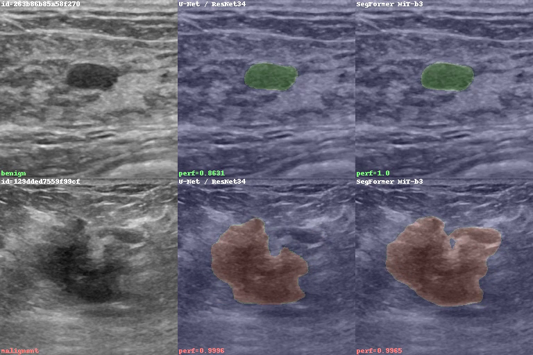

I have completed the Master of Science in Data Science (MSDS) program at the University of Wisconsin. This is my capstone project - code, paper, and artifacts.

Read the full paper here (CTRL-click or right-click to open in new tab):

[Semantic Segmentation for Medical Ultrasound Imaging](Capstone%20Paper%20-%20Semantic%20Segmentation%20for%20Medical%20Ultrasound%20Imaging.pdf)

Video of my models looking for benign / malignant lesions on ultrasound images (CTRL-click or right-click to open in new tab):

# Tech Details

## Datasets

Vision models need to be trained on large datasets. Ultrasound imaging datasets are small and hard to find. The project had access to four small fully labeled datasets, and one large dataset that had class labels (benign, malignant) but no mask labels.

I wrote dataloader functions to take images from all four fully labeled datasets, and present them to the models like a single, larger, uniform dataset of nearly 1800 images total.

Typical image augmentations were applied to the datasets, with some adjustments for this specific domain - see the paper for details.

The video you see above contains predictions on the large, partially labeled dataset, which had nearly 200 video sequences with a total of about 25k image frames.

## Models

Just to be on the safe side, I've trained an older architecture, U-Net with a ResNet34 backbone, which was known to work well on ultrasound datasets.

To try and get the best performance possible, I've also trained a transformer model, the SegFormer.

Both models were pre-trained on ImageNet.

## Hyperparameter Optimization

This was the most time-consuming part of the project. Training a single model on an RTX 3090 GPU takes about 1 hour. I had a hyperparameter optimization loop, with Optuna, running a search in hyperparameter space for the best performance.

The performance metric that was optimized is intersection-over-union (IoU).

For more details see the paper, but basically the learning rate had by far the biggest impact on model performance. The number of freeze epochs mattered somewhat for U-Net. The warmup ratio had a mild impact on the SegFormer. The rest basically were irrelevant.

# Results

When doing semantic segmentation, which involved segmenting the image and also assigning class values to the predicted mask pixels, the mean IoU performance across both classes (benign and malignant) on the validation dataset was:

- U-Net: 64.2%
- SegFormer: 74.7%

When I dropped the classes and simply tried to find lesions regardless of their class (benign and malignant together), the performance was:

- SegFormer: 89%

Some of the numbers are small when compared to state-of-the-art models segmenting city street images, etc. But ultrasound images are noisy, the objects don't always have clear borders, and the quality of the labels (manually drawn masks) is not always very good.

All things considered, I think SegFormer did very well.

Larger datasets with higher quality labels will certainly improve performance beyond the numbers shown here.
